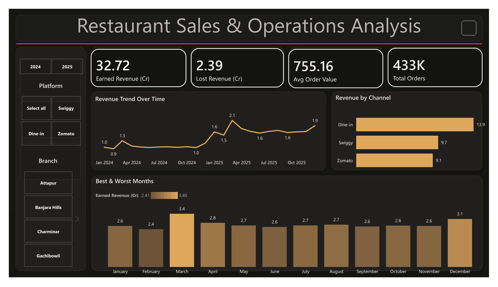
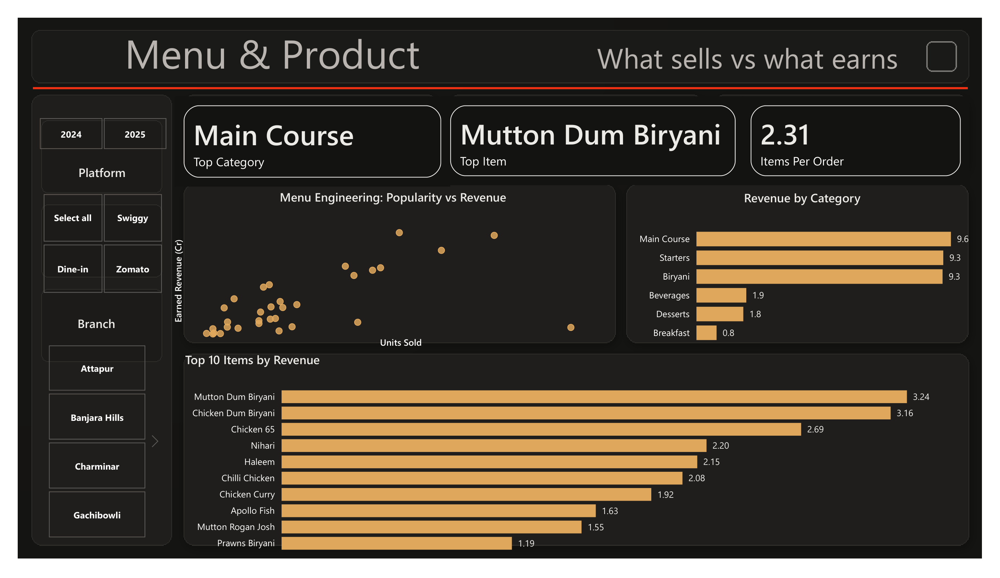
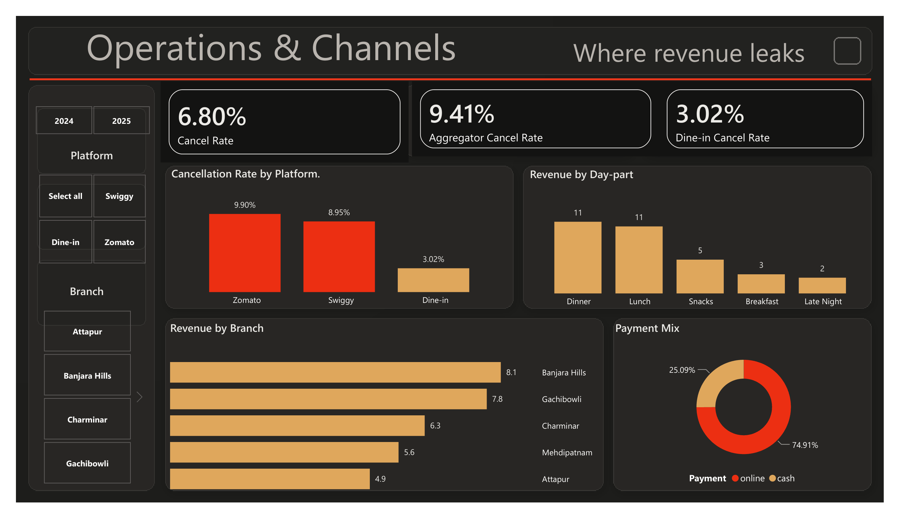

# Restaurant Sales & Operations Analysis

A full data project for a multi branch Hyderabadi restaurant. It goes from raw order data all the way to a three page Power BI dashboard, and it answers the questions a restaurant owner actually cares about: how much are we making, what sells, and where are we losing money.

> Note on the data: this project uses a realistic simulated dataset, not real sales from a real business. The data was generated by a script that is included in this repo (`scripts/gen.py`), so the patterns are believable but nothing here is a real client's numbers. This is a demonstration of how I work.

## The dashboard

Three pages.

### 1. Overview
Headline numbers, revenue trend, dine in versus delivery, and the best and worst months.

### 2. Menu and Product
Top items, revenue by category, and a menu engineering view of popularity against revenue.

### 3. Operations and Channels
The cancellation story, day part performance, branch revenue, and payment mix.

## The business question

The owner runs five outlets across Hyderabad and sells through dine in as well as Swiggy and Zomato. Two years of orders had piled up, but no one had turned that data into answers. The goal was simple: read the data and tell the owner what to do next.

## What I looked at

1. How much revenue came in, and is the business growing.
2. What earns the money on the menu, and what just fills volume.
3. Where revenue leaks, and how to stop it.

## What the data said

**Revenue and growth.** The business earned about 32.7 crore over two years, with 2025 running well ahead of 2024. Revenue peaks in March and December and dips over the summer, so promotions are best aimed at the slow months.

**The menu.** Main Course and Starters lead the revenue, and biryani is a close third. The premium dishes like the biryanis, Chicken 65 and Nihari bring in the most money. Cheap items like breakfast and beverages sell in high volume but earn very little, so they fill seats without driving revenue.

**The main problem: cancellations.** About 2.4 crore was lost to cancelled orders. Almost all of it sits on the delivery apps. Swiggy and Zomato cancel close to 9 to 10 percent of orders, while dine in cancels only about 3 percent. So the leak is a channel problem, not a branch or timing problem.

**Channels and branches.** Dine in is the single biggest channel by revenue. Branches perform in a clear order, with Banjara Hills and Gachibowli leading. Dinner and lunch are the busiest parts of the day, which matters for staffing.

## Recommendations

1. Fix the aggregator cancellations first, since that is where nearly all the lost revenue is.
2. Protect and promote the high earning dishes, and rethink the low earning items that take up menu space.
3. Push promotions into the slow summer months to smooth out the year.

## How it was built

The whole pipeline is in one SQL file so you can read the thinking start to finish.

1. **EDA** in SQL Server. Checked row counts, data types, value ranges, missing values, duplicates, and hidden characters.
2. **Modeling.** Built a view (`vw_restaurant_sales`) that joins the orders to the menu and calculates the sales amount per line.
3. **Analysis.** Answered every question above with SQL.
4. **Dashboard.** A three page Power BI report on a dark theme that matches the Basirah Analytics website.

## Key definitions and assumptions

So the numbers are clear and defensible:

- Earned revenue means completed plus refunded orders. Refunds are treated as revenue the outlet still kept.
- Lost revenue means cancelled orders only.
- This is a demonstration dataset, so the findings describe patterns in the data and do not claim real world causes.

## What this data cannot show

Being honest about the limits:

- There is no cost data, so there is no profit or margin analysis.
- There is no customer id, so there is no repeat customer or retention analysis.
- There is no table data, so there is no table turnover.

## Files in this repo

- `sql/Restaurant_Analysis_Full.sql` — the full pipeline: EDA, view, and analysis
- `scripts/gen.py` — the script that generates the demonstration dataset
- `data/` — the menu and a 1,000 row sample of the orders (run gen.py to recreate the full data)
- `dashboard/` — the three dashboard pages and the full PDF
- `case-study.md` — a short version of this story for the website

## Tools

SQL Server (SSMS), Power BI, Python (for data generation).

---

Built by Haseeb Ur Rahman · [Basirah Analytics](https://basirahanalytics.com)
